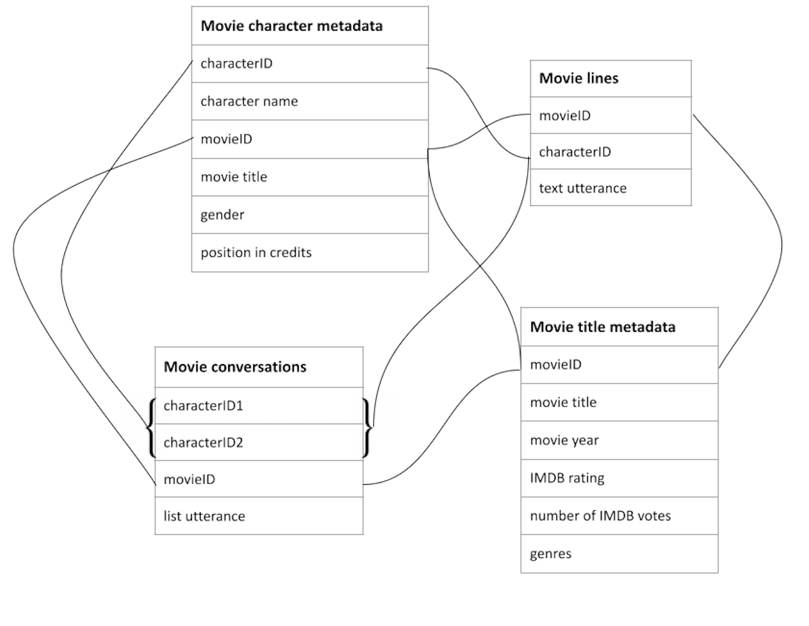

# **Investigating female representation in Science Fiction movies**

## Table of Contents
- [The provenance of the data](#the-provenance-of-the-data)
- [The data model used for the research questions](#the-data-model-used-for-the-research-questions)
- [The curation of the data and the choices made](#the-curation-of-the-data-and-the-choices-made)
- [The steps taken to annotate or enrich the data](#the-steps-taken-to-annotate-or-enrich-the-data)
- [Tools](#tools)

## The provenance of the data
The [orginal dataset](original_dataset) used is created by Danescu-Niculescu-Mizil & Lee (2011) and includes movie metadata. The dataset was constructed by extracting movie scripts from publicly available websites and linking these to IMDB movie data for their study on conversational adaptation mechanisms of characters in movies. 

## The data model used for the research questions

  

## The curation of the data and the choices made
## The steps taken to annotate or enrich the data
## Tools 
The tools used to  enrich the orginal dataset of Danescu-Niculescu-Mizil & Lee (2011) are: 
* Google Spreadsheets,  
* Python, jupyter notebook
* IMDB cast and crew website, and 
* scripts of the movies 

